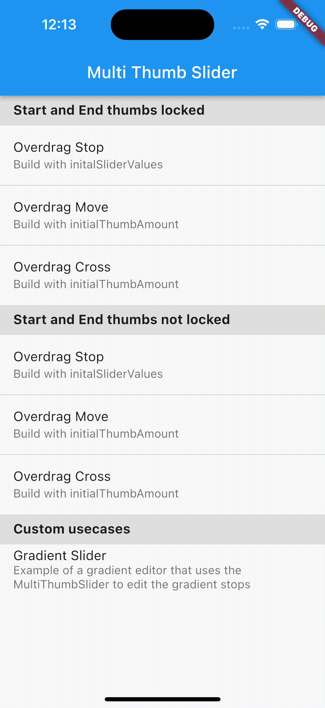

<!--
This README describes the package. If you publish this package to pub.dev,
this README's contents appear on the landing page for your package.

For information about how to write a good package README, see the guide for
[writing package pages](https://dart.dev/guides/libraries/writing-package-pages).

For general information about developing packages, see the Dart guide for
[creating packages](https://dart.dev/guides/libraries/create-library-packages)
and the Flutter guide for
[developing packages and plugins](https://flutter.dev/developing-packages).
-->

[](https://flutter.dev)
[](https://pub.dev/packages/multi_thumb_slider)
<a href="https://twitter.com/janniks_dev?ref_src=twsrc%5Etfw">
    
  </a>


This Flutter package is a customizable slider widget that provides support for more than two thumbs. It provides an easy implementation of a slider with multiple thumbs that represent values in a range from 0 to 1. The slider can be customized with a custom background widget and a custom thumb builder. It is a powerful tool for creating intuitive and interactive user experiences, e.g. if a gradient creator needs to be implemented in a app.

> ### IMPORTANT
> The package only supports sliders with more than 2 thumbs. For 2 or less thumbs the native widgets [Slider](https://api.flutter.dev/flutter/material/Slider-class.html) and [RangeSlider](https://api.flutter.dev/flutter/material/RangeSlider-class.html) should be used.

## Features

Different use cases can be covered by using the package:

| Linear Gradient creator | Overdrag moves other thumbs | Overdrag stops at next thumb |
|-------------------------|-----------------------------|--------------------------|
|  |  |  |

> ### IMPORTANT
> Using the *Overdrag Move* behaviour with a large amount of thumbs might impact the performace of your app. Please use this behaviour it with caution.

## Usage

There are two constructors available: `MultiThumbSlider` which takes `initialSliderValues` as parameter to create the slider with thumbs at specific values. And `MultiThumbSlider.distributed` which takes an intger > 2 in the `initialThumbAmount` parameter.

Please read the API documentation for detailed information how the different parameters work together and how the MultiThumbSliderController can be used in detail.

Example:

```dart
 MultiThumbSlider(
    initalSliderValues: [0.0, 0.1, 0.2, 0.9, 1.0],
    valuesChanged: (List<double> values) {
        // Everytime any thumb is dragged a List of all thumb values
        // is passed via valuesChanged.
    },
    // Optional: Overdrag behaviour of the thumbs.
    // Defaults to ThumbOverdragBehaviour.stop
    overdragBehaviour: ThumbOverdragBehaviour.move,
    // Optional: Lock behaviour of the first an last thumb.
    // Defaults to ThumbLockBehaviour.stop
    lockBehaviour: ThumbLockBehaviour.none,
    // Optional: Custom builder function for the thumb
    thumbBuilder: (BuildContext context, int index) => Text("$index"),
    // Optional: Background widget of the slider.
    background: Container(
        height: 10,
        decoration: BoxDecoration(
            color: Colors.red,
        ),
    ),
    // Optional: Height of the Widget. Defaults to 48.
    height: 72,
    // Optional: MultiThumbSliderController can be used to control the slider after build. E.g adding/removing thumbs, get current values, move thumb, etc.
    controller: MultiThumbSliderController()
),
```

## Bugs or Requests
If you encounter any problems feel free to open an issue. If you feel the library is missing a feature, please raise a ticket on GitHub and I hope I find some time to look into it. Pull requests are also welcome.
